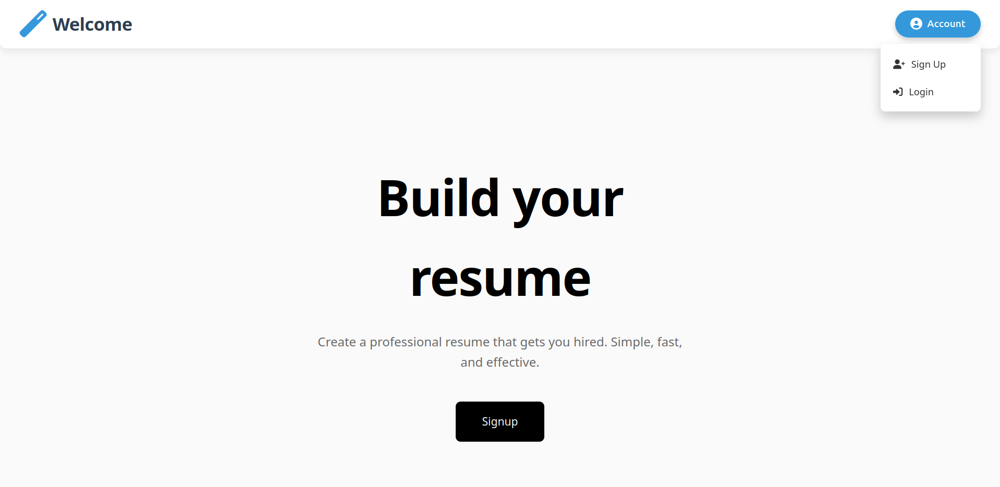
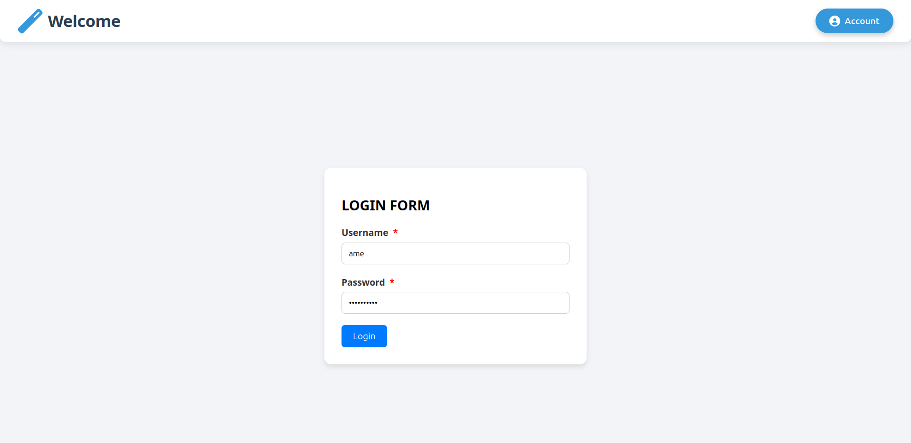
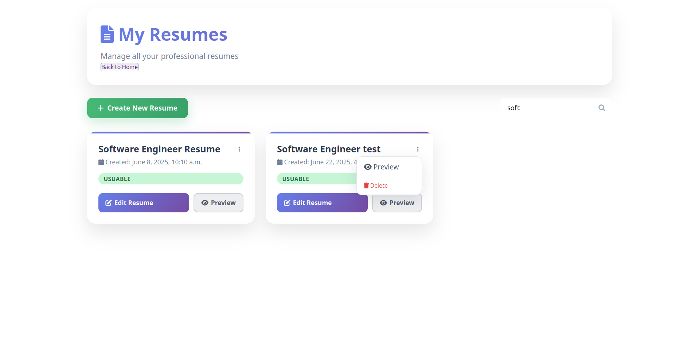
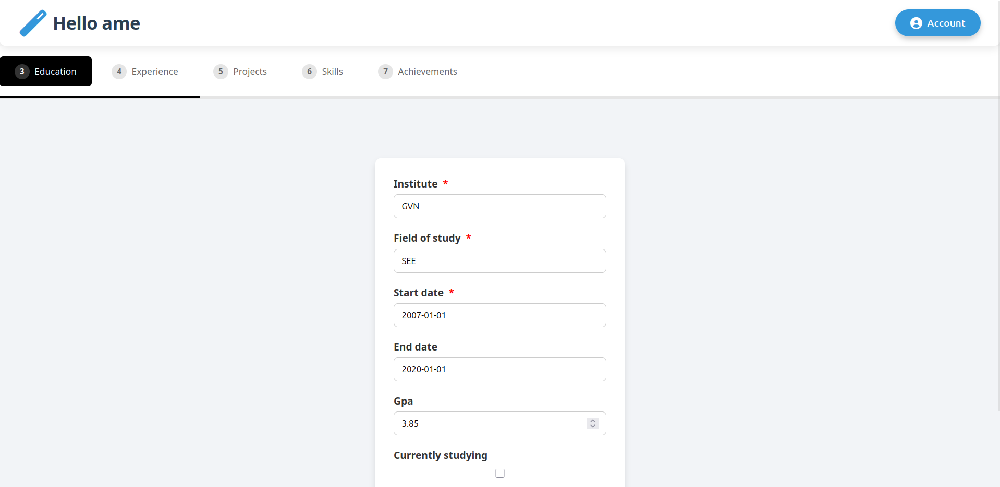
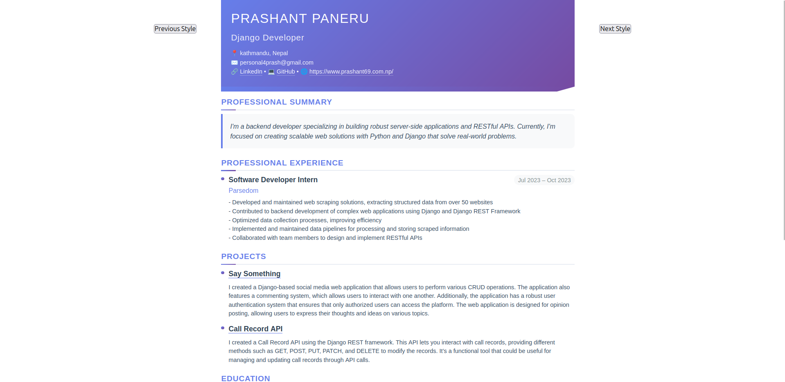
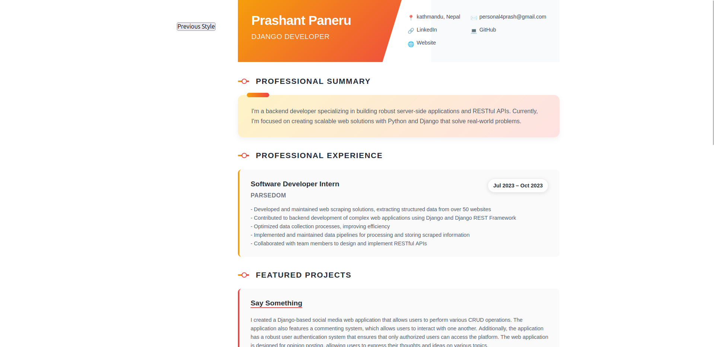
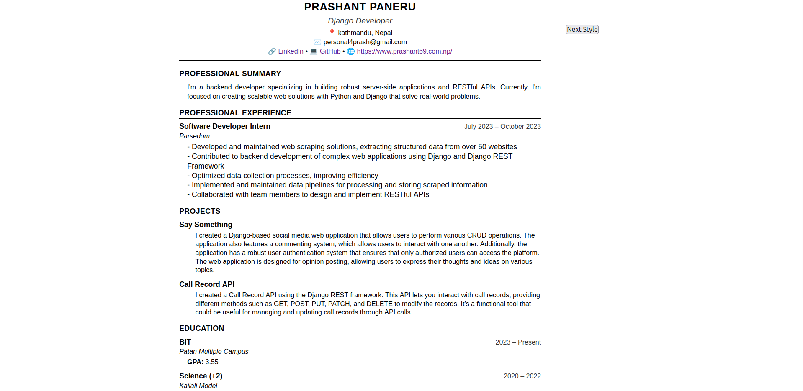
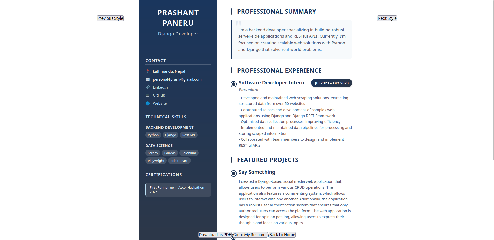

# AutoCV: Automatic Resume Builder

AutoCV is a powerful Django-based web application designed to simplify the resume creation process. It allows users to quickly and efficiently build professional resumes by filling out a series of intuitive forms, and then download them in various customizable styles.

## ✨ Features

* **Guided Form Filling:** Easily input your personal information, education, experience, projects, and more through dedicated forms.

* **Multiple Resume Styles:** Choose from 4 distinct, professionally designed resume templates to match your personal brand.

* **PDF Download:** Generate and download your complete resume in PDF format, ready for sharing.

* **User Authentication:** Securely manage your resume data with user signup and login functionality.

## 🚀 Getting Started

Follow these steps to set up and run AutoCV on your local machine.

### Prerequisites

Make sure you have Python 3 and `pip` installed.

### Installation

1. **Clone the repository:**

```

git clone https://github.com/pr45h4nt/AutoCV.git
cd AutoCV

```

2. **Create a virtual environment (recommended):**

```

python3 -m venv venv
source venv/bin/activate \# On Windows: .\\venv\\Scripts\\activate

```

3. **Install dependencies:**

```

pip install -r requirements.txt

```


4. **Apply database migrations:**

```
python3 manage.py makemigrations
python3 manage.py migrate

```

5. **Run the development server:**

```

python3 manage.py runserver

```

The application will now be accessible at `http://127.0.0.1:8000/`.

## 🖥️ Usage

1. **Access the Application:** Open your web browser and navigate to `http://127.0.0.1:8000/`.

2. **Signup or Login:** If you're a new user, sign up for an account. Otherwise, log in with your existing credentials.

3. **Fill out Forms:** You will be guided through various forms to enter your resume details:

* Personal Information

* Education

* Work Experience

* Projects

* Skills

* ... and more!

4. **Generate Resume:** Once you've filled in your information, navigate to the resume generation section.

5. **Choose Style & Download:** Select one of the 4 available resume styles and click the "Download PDF" button to get your professional resume.

## 🎨 Available Resume Styles

AutoCV currently offers 4 distinct resume styles:

* [Style Name 1 - e.g., "Classic SE"]

* [Style Name 2 - e.g., "Modern V1"]

* [Style Name 3 - e.g., "Modern V2"]

* [Style Name 4 - e.g., "Modern V3"]

## Pictures 










## 🤝 Contributing

Contributions are welcome! If you have suggestions for improvements or new features, please feel free to:

1. Fork the repository.

2. Create a new branch (`git checkout -b feature/AmazingFeature`).

3. Commit your changes (`git commit -m 'Add some AmazingFeature'`).

4. Push to the branch (`git push origin feature/AmazingFeature`).

5. Open a Pull Request.

## 📄 License

This project is licensed under the [Your Chosen License] - see the `LICENSE` file for details
